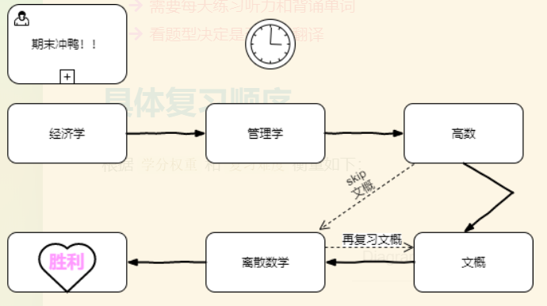

# 学分占比

科目  | 学分
 - | -
高等数学  | 5
Python编程基础  | 4
离散数学 | 3
大学英语 | 3
经济学通论 | 2
管理学通论 | 2
中国文化概论 | 2
体育 | 2
# 各科复习情况
 - 西方经济学
	 - 微观部分：8/11
	 - 宏观部分：0/5
- 管理学
	-	未开始
- 高数
	- 未开始
- 离散数学
	- 未开始
- Python基础
	- 未开始
- 中国文化概论
	- 未开始
- 大学英语
	-	需要每天练习听力和背诵单词
	-	看题型决定是否要背翻译

# 具体复习顺序
根据`学分权重`和`复习难度`衡量如下：

